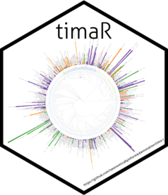

# Taxonomically Informed Metabolite Annotation 

<!-- badges: start -->
[](https://app.codecov.io/gh/taxonomicallyinformedannotation/tima-r?branch=main)
[](https://github.com/taxonomicallyinformedannotation/tima-r/actions)
[](https://lifecycle.r-lib.org/articles/stages.html#stable)
<!-- badges: end -->

The initial work is available at https://doi.org/10.3389/fpls.2019.01329, and many improvements have been made since then.
The worklow is illustrated in Figure 1.


This repository contains everything needed to perform **T**axonomically **I**nformed **M**etabolite **A**nnotation.

It is provided with an example from well-known pharmacopoeia plants.

Here is what you *minimally* need:

- A feature list with *or without* candidate annotations, if you are using GNPS, it can be your GNPS job ID.
- The source organism of the extract you are annotating, if you are associating metadata within GNPS, it can be your
  GNPS job ID.
- An edge list, if you are using GNPS, it can be your GNPS job ID.

Optionally, you may want to add:

- An in-house structure-organism pairs library (we provide **LOTUS** as starting point for each user)
- Your own manual or automated annotations (we currently support annotations coming from ISDB and SIRIUS)

## Installation


As the package is not (yet) available on CRAN, you will need to install the development version, therefore:

```shell
Rscript -e 'if(!requireNamespace("remotes")){install.packages("remotes")}
remotes::install_github("taxonomicallyinformedannotation/tima-r")'
```

or in R directly:

```shell
if(!requireNamespace("remotes", quietly = TRUE))
    install.packages("remotes")
remotes::install_github("taxonomicallyinformedannotation/tima-r")
```

## Use

### Copy initial parameters

```shell
# copy the default params to adapat to your data later on
cp -R config/default config/params
```

### Structure-organism pairs library

```shell
Rscript inst/scripts/get_lotus.R
Rscript inst/scripts/prepare_lotus.R
# Rscript inst/scripts/prepare_closed.R # only if you have access to it
Rscript inst/scripts/prepare_library.R
Rscript inst/scripts/prepare_adducts.R
```

### Annotations

#### Get MS2 annotations

```shell
# (spectral_lib_matcher, which is only in python. see related repo)
# instead we provide an example file coming from the new ISDB.
# It also works with annotations coming from GNPS (see next steps)
Rscript inst/scripts/get_example_isdb.R
```

#### Format MS2 annotations

```shell
# depending on the annotation tool you used
Rscript inst/scripts/prepare_gnps.R # optional
Rscript inst/scripts/prepare_sirius.R # optional
Rscript inst/scripts/prepare_isdb.R
```

#### Complement MS2 annotations (with spectral clusters and chemical taxonomy of annotations)

```shell
Rscript inst/scripts/prepare_edges.R
Rscript inst/scripts/prepare_features_components.R
Rscript inst/scripts/prepare_features_classification.R
```

#### Get biological taxonomy information

```shell
bash inst/scripts/get_gnverifier.sh
Rscript inst/scripts/prepare_taxa.R
```

### And finally the graal!

```shell
Rscript inst/scripts/process_annotations.R
```

NOTE: you can use --help or -h argument for all .R steps to get more info
