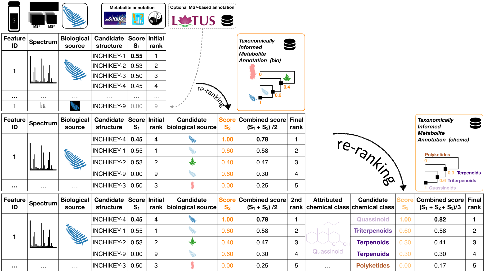

# Taxonomically Informed Metabolite Annotation

The initial work is available at https://doi.org/10.3389/fpls.2019.01329, and many improvements have been made since then. 
The worklow is illustrated in Figure 1.



This repository contains everything needed to perform **T**axonomically **I**nformed **M**etabolite **A**nnotation.

It is provided with an example from well-known pharmacopoeia plants.

Here is what you *minimally* need:

- A feature list with *or without* candidate annotations, if you are using GNPS, it can be your GNPS job ID.
- The source organism of the extract you are annotating, if you are associating metadata within GNPS, it can be your
  GNPS job ID.
- An edge list, if you are using GNPS, it can be your GNPS job ID.

Optionally, you may want to add:

- An in-house structure-organism pairs library (we provide **LOTUS** as starting point for each user)
- Your own manual or automated annotations (we currently support annotations coming from ISDB and SIRIUS)

## Repo preparation

```shell
git clone git@github.com:taxonomicallyinformedannotation/tima-r.git
cd tima-r
```

### Windows Notice

If you are using Windows, please install [WSL2](https://docs.microsoft.com/en-us/windows/wsl/compare-versions#whats-new-in-wsl-2)

Please also follow the procedure described [here](https://stackoverflow.com/questions/2517190/how-do-i-force-git-to-use-lf-instead-of-crlf-under-windows/13154031#13154031) to ensure files will be proberly encoded.

### To run in docker:

```shell
docker build -t tima . # optional
docker run -it --rm -v $PWD:/app tima
```

### To run locally:

```shell
conda env create -f environment.yml &&
conda activate tima
```

## Copy initial parameters

```shell
# copy the default params to adapat to your data later on
cp -R config/default config/params
```

## Structure-organism pairs library

```shell
bash src/get_lotus.sh && 
Rscript src/prepare_lotus.R &&
# Rscript src/prepare_dnp.R && # only if you have access to it
Rscript src/prepare_library.R &&
Rscript src/prepare_adducts.R &&
```

## Annotations

### Get MS2 annotations

```shell
# (spectral-lib-matcher, which is only in python. see related repo)
# instead we provide an example file coming from the new ISDB.
# It also works with annotations coming from GNPS (see next steps)
bash src/get_example_isdb.sh
```

### Format MS2 annotations

```shell
# depending on the annotation tool you used

Rscript src/prepare_gnps.R && # optional
Rscript src/prepare_sirius.R && # optional
Rscript src/prepare_isdb.R &&
```

### Complement MS2 annotations (with spectral clusters and chemical taxonomy of annotations)

```shell
Rscript src/prepare_edges.R && 
Rscript src/prepare_features_components.R &&
Rscript src/prepare_features_classification.R &&
```

### Get biological taxonomy information

```shell
bash src/get_gnverifier.sh && 
Rscript src/prepare_taxa.R 
```

## And finally the graal!

```shell
Rscript src/process_annotations.R
```

NOTE: you can use --help or -h argument for all .R steps to get more info
