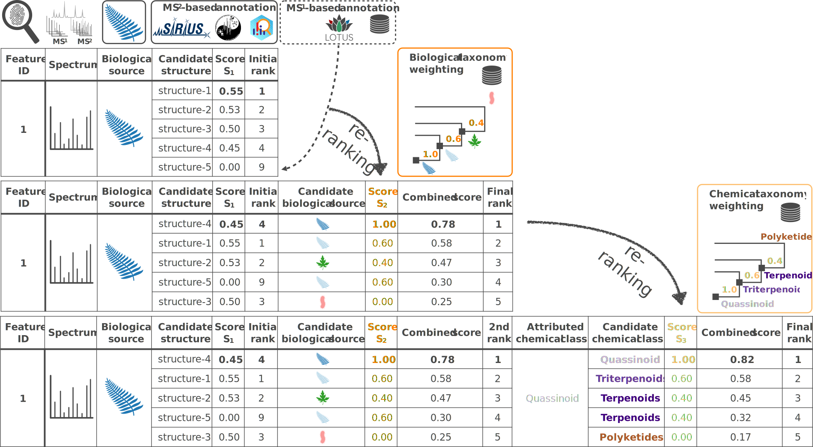

# Taxonomically Informed Metabolite Annotation 

<!-- badges: start -->
[](https://app.codecov.io/gh/taxonomicallyinformedannotation/tima-r?branch=main)
[](https://github.com/taxonomicallyinformedannotation/tima-r/actions)
[](https://lifecycle.r-lib.org/articles/stages.html#stable)
<!-- badges: end -->

The initial work is available at https://doi.org/10.3389/fpls.2019.01329, and many improvements have been made since then.
The workflow is illustrated below.



This repository contains everything needed to perform **T**axonomically **I**nformed **M**etabolite **A**nnotation.

It is provided with an example from well-known pharmacopoeia plants.

Here is what you *minimally* need:

- A feature list with *or without* candidate annotations, if you are using GNPS, it can be your GNPS job ID.
- The source organism of the extract you are annotating, if you are associating metadata within GNPS, it can be your
  GNPS job ID.
- An edge list, if you are using GNPS, it can be your GNPS job ID.

Optionally, you may want to add:

- An in-house structure-organism pairs library (we provide **[LOTUS](https://lotusnprod.github.io/lotus-manuscript)** as starting point for each user)
- Your own manual or automated annotations (we currently support annotations coming from ISDB and SIRIUS (with some limitations))

## Installation

As the package is not (yet) available on CRAN, you will need to install the development version, therefore:

On UNIX systems:
```shell
Rscript -e 'if(!requireNamespace("remotes")){install.packages("remotes")}
remotes::install_github("taxonomicallyinformedannotation/tima-r")'
```

On Windows:
```shell
Rscript -e "if(!requireNamespace('remotes')){install.packages('remotes')}
remotes::install_github('taxonomicallyinformedannotation/tima-r')"
```

or in R directly:

```shell
if(!requireNamespace("remotes", quietly = TRUE))
    install.packages("remotes")
remotes::install_github("taxonomicallyinformedannotation/tima-r")
```

Once installed, you are ready to go through our [documentation](https://taxonomicallyinformedannotation.github.io/tima-r/articles/), with the major steps detailed.

Do not forget to clone the repository (it will allow you to access default architecture, files, and parameters):

```shell
git clone https://github.com/taxonomicallyinformedannotation/tima-r.git
cd tima-r
```

Then, copy the defaut parameters:

```shell
rsync -a --delete config/default/ config/params
```

Once done, you can start with an example using:

```shell
Rscript inst/scripts/tima.R
```
