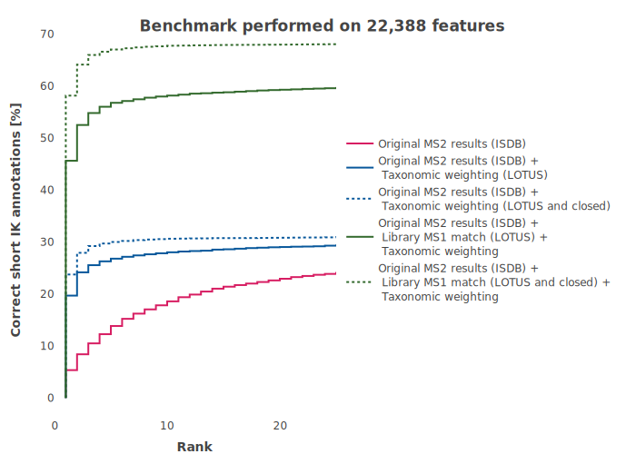

```{r setup, include = FALSE}
knitr::opts_chunk$set(
  collapse = TRUE,
  comment = "#>"
)
knitr::opts_knit$set(root.dir = '..')
knitr::opts_chunk$set(dev = "svg")
# knitr::opts_chunk$set(fig.path = "man/figures/")
```

This vignette simply shows the actual performance of TIMA.

The benchmarking dataset was built using https://zenodo.org/record/5186176.

It contains positive MS2 spectra of multiple ion species ([M+H]+, [M+Na]+, [M+NH4]+, ...) coming from different mass spectrometers.

## Best 500 candidates
\

## Best 25 candidates (zoomed)
\
