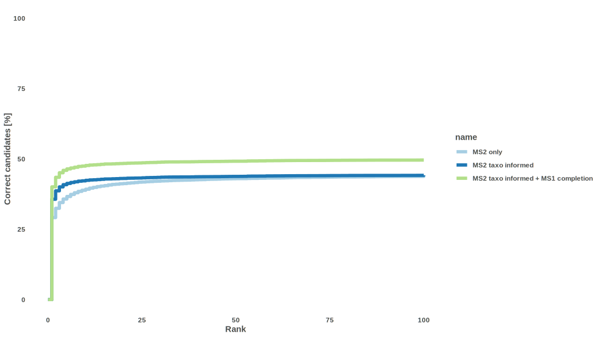

```{r setup, include = FALSE}
knitr::opts_chunk$set(
  collapse = TRUE,
  comment = "#>"
)
```

This vignette simply shows the actual performance of TIMA.

The benchmarking dataset was built using [https://zenodo.org/record/5186176](https://zenodo.org/record/5186176).

It contained positive and negative MS^2^ spectra of multiple ion species ([M+H]^+^, [M+Na]^+^, [M+NH4]^+^, ...) coming from different mass spectrometers.

In positive mode,
It was filtered to 22,251 spectra, representing 12,482 structures without stereo.
Of those, only 16,136 spectra (72.5%) corresponded to structures present in the library we used to annotate.

In negative mode,
It was filtered to 7,472 spectra, representing 6,587 structures without stereo.
Of those, only 5,025 spectra (67.4%) corresponded to structures present in the library we used to annotate.

## Best 500 candidates
### Positive
```{r, echo=FALSE}
knitr::include_graphics("benchmark_full_pos.svg")
```

### Negative
```{r, echo=FALSE}

```

## Best 25 candidates (zoomed)
### Positive
```{r, echo=FALSE}
knitr::include_graphics("benchmark_zoomed_pos.svg")
```

### Negative
```{r, echo=FALSE}
knitr::include_graphics("benchmark_zoomed_neg.svg")
```

## Candidates distribution
### Positive
```{r, echo=FALSE}
knitr::include_graphics("benchmark_comparison_pos.svg")
```

### Negative
```{r, echo=FALSE}
knitr::include_graphics("benchmark_comparison_neg.svg")
```
