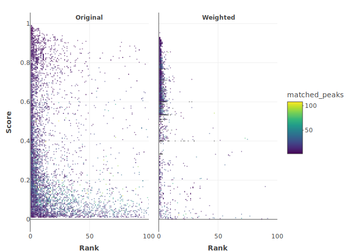

```{r setup, include = FALSE}
knitr::opts_chunk$set(
  collapse = TRUE,
  comment = "#>"
)
```

This vignette simply shows the actual performance of TIMA.

The benchmarking dataset was built using [https://zenodo.org/record/5186176](https://zenodo.org/record/5186176).

It contains positive MS2 spectra of multiple ion species ([M+H]+, [M+Na]+, [M+NH4]+, ...) coming from different mass spectrometers.
It was filtered to 22,251 spectra, representing 12,482 2D structures.
Of those, only 13,936 spectra (62%) correspond to structures present in the library we use to annotate.

## Best 500 candidates
```{r, echo=FALSE}
knitr::include_graphics("benchmark_full.svg")
```

## Best 25 candidates (zoomed)
```{r, echo=FALSE}
knitr::include_graphics("benchmark_zoomed.svg")
```

## Candidates distribution
```{r, echo=FALSE}

```
