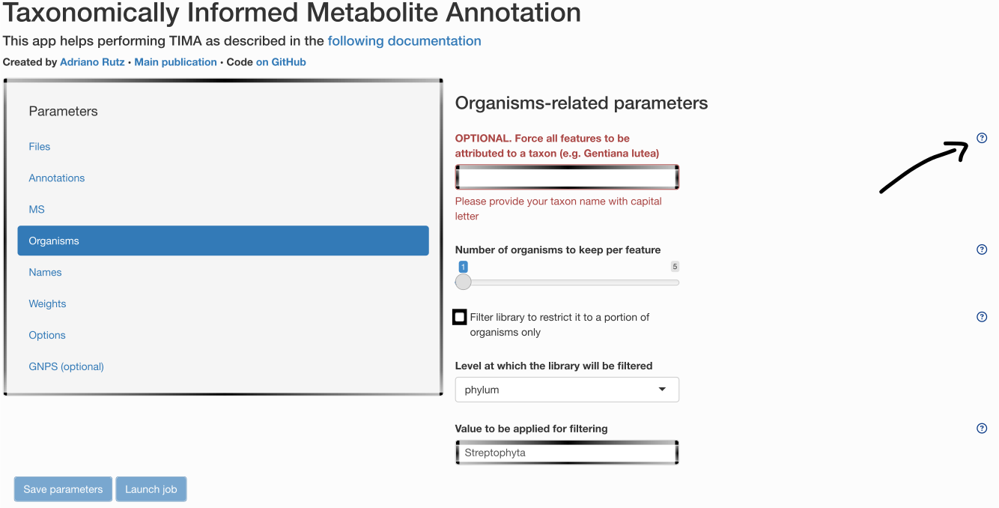
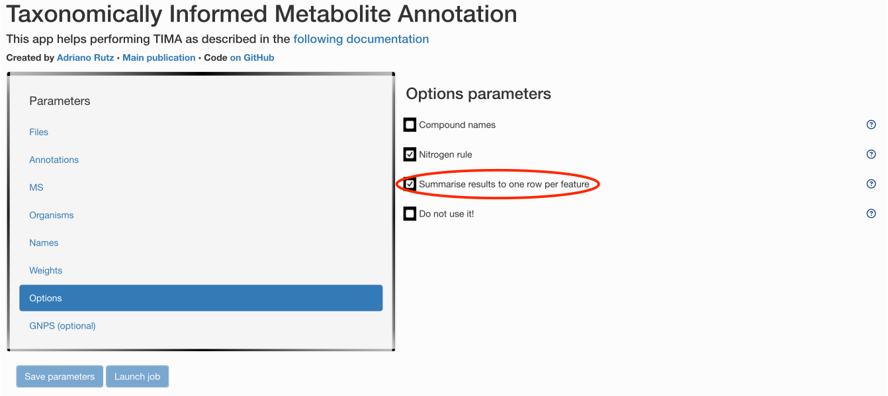

```{r}
#| label: tima
#| include: false

library("tima")
if (dir.exists("../../inst")) {
  knitr::opts_knit$set(root.dir = "../../inst")
}
```

This vignette describes...

- All parameters you need
- All inputs you need

## Parameters

All steps require parameters. Some default parameters are available and can be
accessed in the `params/default` directory. If you prefer accessing them through
the GUI, you can do so. Each parameter contains a small help menu, you can click
on, as illustrated below.

\

\

For example, if you want to have an output compatible with Cytoscape, with
multiple annotations per features:

\

All parameters will be saved and reported at the end of your analysis.

## Inputs

### Your own files

You should provide your own files in the main menu. For this tutorial, we will
use some example files you can get running:

```{r}
#| label: get-files
#| eval: false
#| include: true

tima::get_example_files()
```

### Libraries

The following paragraph describes the libraries available by default.

#### Spectra

As a first step, you need spectral libraries to perform MS^2^-based annotation.

##### Experimental

You can of course use your own experimental spectral library to perform MS^2^
annotation. We currently support spectral libraries in MSP or MGF format.

To get a small example:

```{r}
#| label: spectra-rt
#| eval: false
#| include: true

tima::get_example_files("spectral_lib_with_rt")
```

###### GNPS, MassBank & MERLIN

GNPS, MassBank & MERLIN are downloaded and used by default, for more info about
them, see <https://github.com/Adafede/SpectRalLibRaRies>.

In case you want to format your own spectral library to use it for spectral
matching, adapt it the same way.

```{r}
#| label: spectra-mb
#| eval: false
#| include: true

targets::tar_make(
  names = tidyselect::matches("lib_spe_exp")
)
```

##### *In silico*

As the availability of experimental spectra is limited, we can take advantage of
*in silico* generated spectra.

#### Wikidata

We generated an *in silico* spectral library of the structures found in Wikidata
using [CFM4](https://doi.org/10.1021/acs.analchem.1c01465). For more info, see
<https://doi.org/10.5281/zenodo.5607185>. It is made available in both
polarities.

```{r}
#| label: get-isdb-wikidata
#| eval: false
#| include: true

targets::tar_make(
  names = tidyselect::matches("lib_spe_is_wik")
)
```

```{r}
#| label: prepare-isdb-wikidata-1
#| eval: false
#| include: true

targets::tar_make(
  names = tidyselect::matches("lib_spe_is_wik_pre")
)
```

You can also complement with the in silico spectra from HMDB (not running by
default as quite long):

#### HMDB

```{r}
#| label: get-isdb-hmdb
#| eval: false
#| include: true

tima::get_example_files("hmdb_is")
```

#### Retention times

This library is **optional**. As no standard LC method is shared (for now) among
laboratories, this library will be heavily laboratory-dependent. It could also
be a library of in silico predicted retention times. If you want to prepare you
own library, have a look at `params/user/prepare_libraries_rt.yaml`.

#### Structure-Organism Pairs

##### LOTUS

As we developed [LOTUS](https://lotusnprod.github.io/lotus-manuscript)^[For more
informations, see <https://doi.org/10.7554/eLife.70780>] with **T**axonomically
**I**nformed **M**etabolite **A**nnotation in mind, we provide it here as a
starting point for your structure-organism pairs library.

```{r}
#| label: get-lotus
#| eval: false
#| include: true

targets::tar_make(
  names = tidyselect::matches("lib_sop_lot$")
)
```

```{r}
#| label: prepare-lotus-2
#| eval: false
#| include: true

targets::tar_make(
  names = tidyselect::matches("lib_sop_lot_pre")
)
```

The process to download LOTUS looks like this:

```{r}
#| label: prepare-lotus-3
#| echo: false
#| message: false
#| warning: false
#| out-width: "100%"

targets::tar_visnetwork(
  names = tidyselect::matches("lib_sop_lot"),
  exclude = targets::contains(
    c(
      "benchmark",
      "par_",
      "paths",
      "test"
    )
  ),
  targets_only = TRUE,
  degree_from = 8
)
```

As you can see, the targets seem outdated. In reality, we force it to search if
a new version of LOTUS exists each time. If a newer version exists, it will
fetch it and re-run needed steps accordingly.

##### BiGG

By default, we also complement LOTUS pairs with the ones coming from
[BiGG](http://bigg.ucsd.edu/).

```{r}
#| label: prepare-bigg-1
#| eval: false
#| include: true

targets::tar_make(
  names = tidyselect::matches("lib_sop_big_pre")
)
```

##### ECMDB

And the ones from [ECMDB](https://ecmdb.ca/).

```{r}
#| label: prepare-ecmdb-1
#| eval: false
#| include: true

targets::tar_make(
  names = tidyselect::matches("lib_sop_ecm_pre")
)
```

##### HMDB

And we do the same with the ones coming from [HMDB](https://hmdb.ca/).

```{r}
#| label: prepare-hmdb
#| eval: false
#| include: true

targets::tar_make(
  names = tidyselect::matches("lib_sop_hmd_pre")
)
```

For these first steps, you do not need to change any parameters as they are
implemented *by default*.

##### Other libraries

As we want our tool to be flexible, you can also add your own library to LOTUS.
You just need to format it in order to be compatible. As example, we prepared
some ways too format closed, *in house* libraries. If you need help formatting
your library or would like to share it with us for it to be implemented, feel
free to contact us. Before running the corresponding code, do not forget to
modify `params/user/prepare_libraries_sop_closed.yaml`.

##### Merging

Once all sub-libraries are ready, they are then merged in a single file that
will be used for the next steps.

```{r}
#| label: libraries-sop-1
#| eval: false
#| include: true

targets::tar_make(
  names = tidyselect::matches("lib_sop_mer")
)
```

```{r}
#| label: libraries-sop-2
#| echo: false
#| message: false
#| warning: false
#| out-width: "100%"

targets::tar_visnetwork(
  names = starts_with("lib_sop"),
  exclude = targets::contains(
    c(
      "benchmark",
      "par_",
      "paths",
      "test"
    )
  ),
  targets_only = TRUE,
  degree_from = 8
)
```

We now recommend you to read the [next
vignette](https://taxonomicallyinformedannotation.github.io/tima/vignettes/articles/II-preparing.html).
