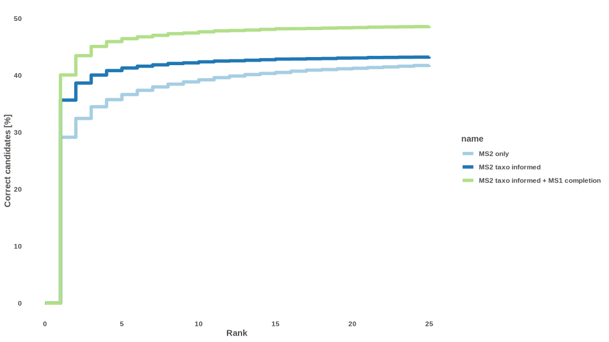

```{r setup, include = FALSE}
knitr::opts_chunk$set(
  collapse = TRUE,
  comment = "#>"
)
```

```{r timar, results="hide", message=FALSE, warning=FALSE, include = FALSE}
library("timaR")
```

This vignette simply shows the actual performance of TIMA.

The benchmarking dataset was built using [https://zenodo.org/record/5186176](https://zenodo.org/record/5186176).

It contained positive and negative MS^2^ spectra of multiple ion species ([M+H]^+^, [M+Na]^+^, [M+H~4~N]^+^, ...) coming from different mass spectrometers.

In positive mode,
It was filtered to 27,789 spectra, representing 17,822 structures without stereo.
Of those, only 15,005 spectra (54.0%) corresponded to structures present in the library we used to annotate.

In negative mode,
It was filtered to 12,060 spectra, representing 9,112 structures without stereo.
Of those, only 6,282 spectra (52.1%) corresponded to structures present in the library we used to annotate.

## Best 100 candidates
### Positive

\

### Negative

\

## Best 25 candidates (zoomed)
### Positive

\

### Negative

\

## Candidates distribution
### Positive

\

### Negative

\
