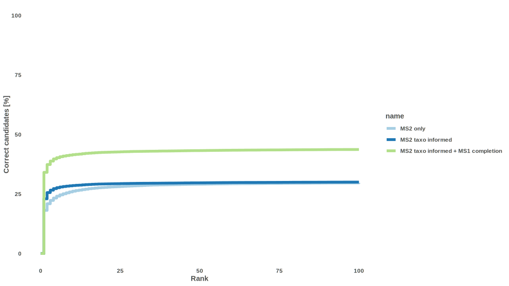
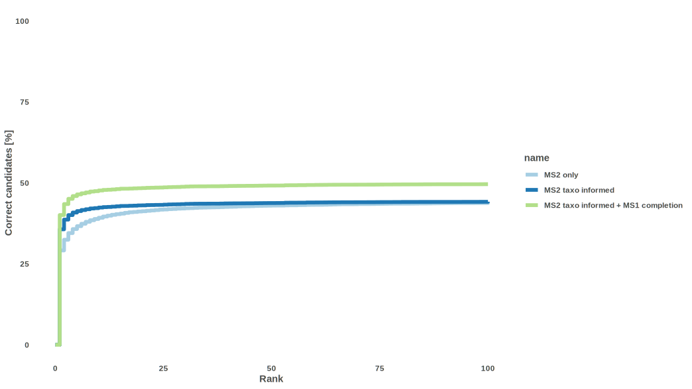
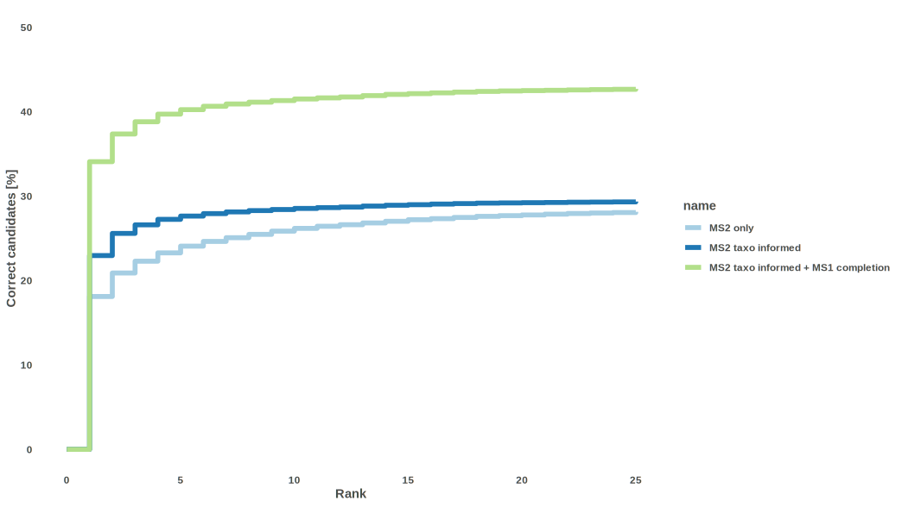
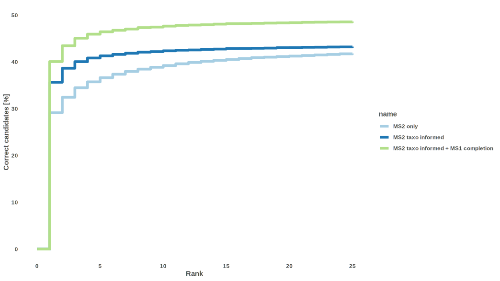
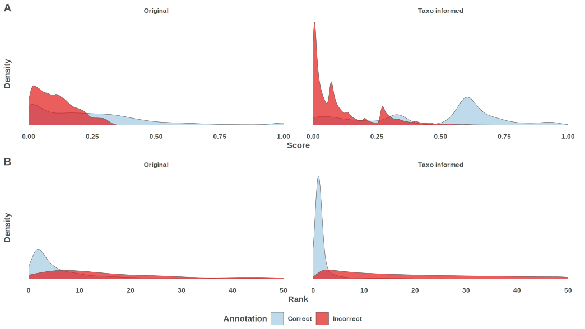
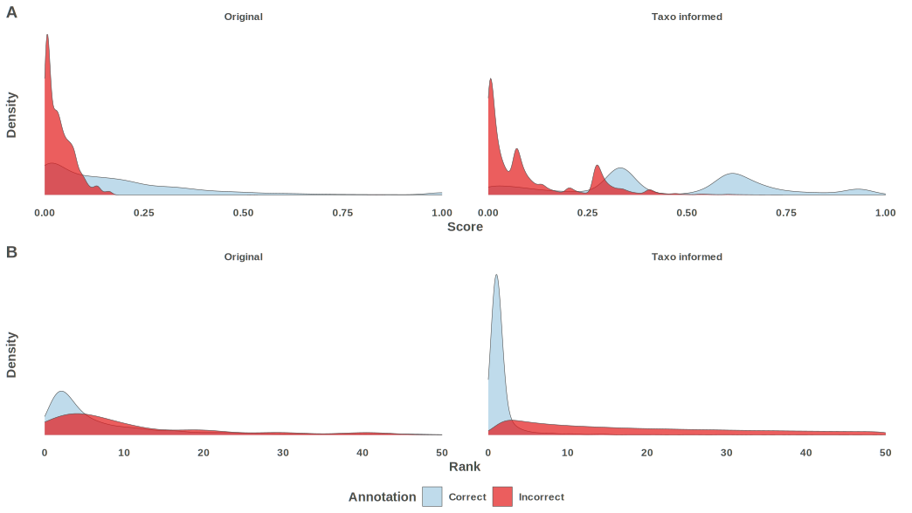

This vignette summarizes benchmark outputs for TIMA and clarifies what is being measured.

The benchmarking dataset was built using <https://zenodo.org/record/11566051>.

It contained positive and negative MS^2^ spectra of multiple ion species ([M+H]^+^, [M+Na]^+^, [M+H~4~N]^+^, ...) coming from different mass spectrometers.

In positive mode,
It was filtered to 27,468 spectra, representing 17,897 structures without stereo.
Of those, only around half corresponded to structures present in the libraries we used to annotate (except GNPS itself).

In negative mode,
It was filtered to 11,760 spectra, representing 8,883 structures without stereo.
Of those, only around half corresponded to structures present in the libraries we used to annotate  (except GNPS itself).

## Evaluation notes

- The curves below are **top-k hit-rate** curves.
- Positive class is exact InChIKey connectivity-layer recovery.
- The benchmark includes out-of-library structures, so we report both:
  - all-query behavior (realistic throughput), and
  - in-library behavior (recoverable subset).
- MCC-based summaries are produced by the targets pipeline in:
  - `data/interim/benchmark/benchmark_metrics_pos.tsv.gz`
  - `data/interim/benchmark/benchmark_metrics_neg.tsv.gz`

## Best 100 candidates
### Positive

\

### Negative

\

## Best 25 candidates (zoomed)
### Positive

\

### Negative

\

## Candidates distribution
### Positive

\

### Negative

\
